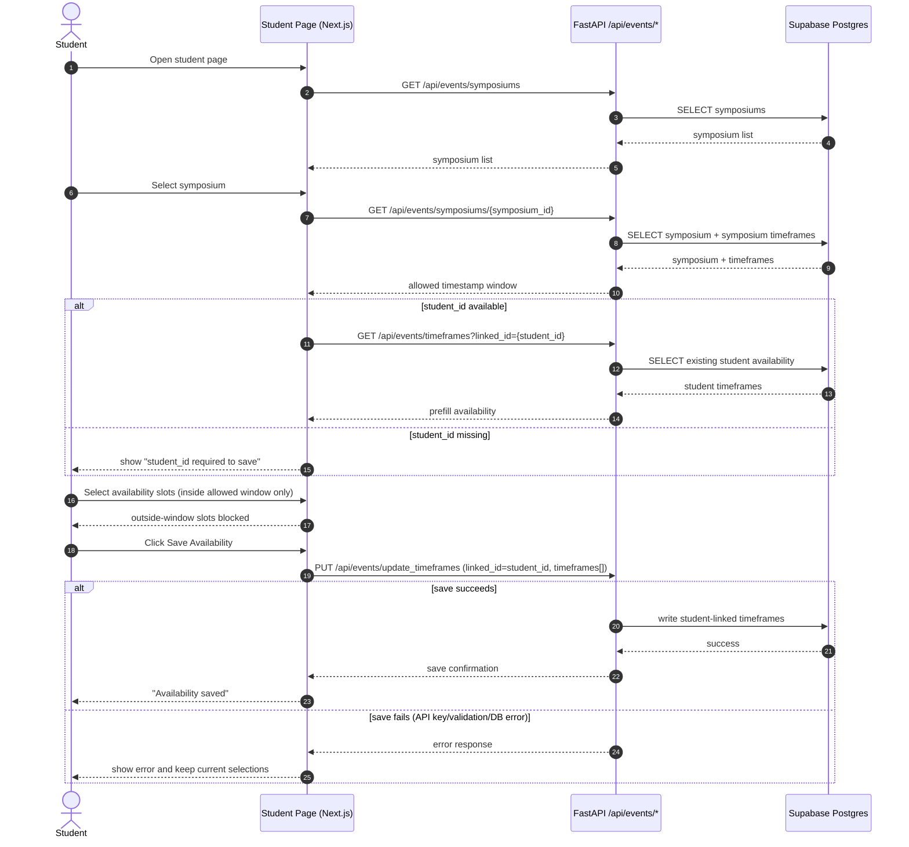

```mermaid
sequenceDiagram
    autonumber
    actor Student
    participant UI as Student Page (Next.js)
    participant API as FastAPI /api/events/*
    participant DB as Supabase Postgres

    Student->>UI: Open student page
    UI->>API: GET /api/events/symposiums
    API->>DB: SELECT symposiums
    DB-->>API: symposium list
    API-->>UI: symposium list

    Student->>UI: Select symposium
    UI->>API: GET /api/events/symposiums/{symposium_id}
    API->>DB: SELECT symposium + symposium timeframes
    DB-->>API: symposium + timeframes
    API-->>UI: allowed timestamp window

    alt student_id available
        UI->>API: GET /api/events/timeframes?linked_id={student_id}
        API->>DB: SELECT existing student availability
        DB-->>API: student timeframes
        API-->>UI: prefill availability
    else student_id missing
        UI-->>Student: show "student_id required to save"
    end

    Student->>UI: Select availability slots (inside allowed window only)
    UI-->>Student: outside-window slots blocked

    Student->>UI: Click Save Availability
    UI->>API: PUT /api/events/update_timeframes (linked_id=student_id, timeframes[])
    alt save succeeds
        API->>DB: write student-linked timeframes
        DB-->>API: success
        API-->>UI: save confirmation
        UI-->>Student: "Availability saved"
    else save fails (API key/validation/DB error)
        API-->>UI: error response
        UI-->>Student: show error and keep current selections
    end

```

## Citations

Diagram conventions and project references are listed in [../CITATIONS.md](../CITATIONS.md).
