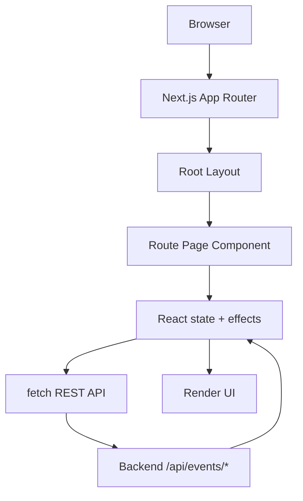
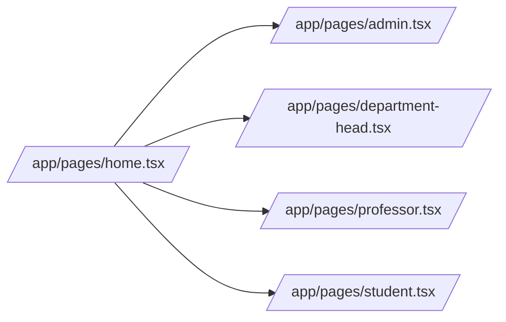
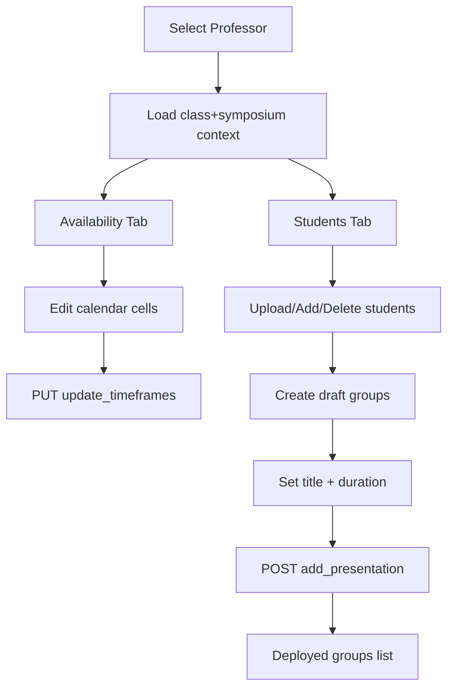
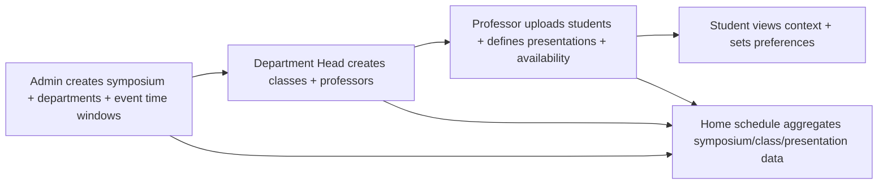

# Frontend Walkthrough (Complete, Medium-Level)

This guide explains the entire frontend in this project for someone starting from zero.

## 1) What frontend stack this project uses

- Framework: Next.js (App Router)
- Language: TypeScript + React
- Styling: Tailwind CSS (plus custom utility/class styling)
- Routing style: file-system routes under `app/`
- Data source: Backend REST API (`NEXT_PUBLIC_BACKEND_URL`)

Frontend root files:

- `app/pages/layout.tsx` (root HTML/body shell)
- `app/globals.css` (global styles and Tailwind import)
- `app/pages/home.tsx` (home/schedule landing page)
- `app/pages/admin.tsx` (admin event + department management)
- `app/pages/department-head.tsx` (department head class/professor management)
- `app/pages/professor.tsx` (professor availability + student/presentation grouping)
- `app/pages/student.tsx` (student availability view + professor requests)
- `app/components/backend-status.tsx` (small health-check component)

## 2) High-level frontend architecture

Role page map:

## 3) Shared patterns used across pages

### Environment variables

Most pages read:

- `NEXT_PUBLIC_BACKEND_URL` (defaults to `http://localhost:8000`)
- `NEXT_PUBLIC_BACKEND_API_KEY` (optional, sent as `X-API-Key`)

### Common data-loading pattern

- `useEffect` runs on mount or selection changes (selected symposium/professor/student)
- Calls backend endpoints with `fetch`
- Parses flexible payload shapes (`data` array or plain array)
- Stores results in `useState`
- Shows status/error text when loading fails

### Calendar/availability grid pattern

Used in `admin`, `professor`, and `student`:

- 32 slots/day (`9:00 AM` to `5:00 PM`, 15-minute intervals)
- Boolean matrix: `availability[dayIndex][slotIndex]`
- Separate matrix often used for edit permissions: `editableSlots`
- Click and drag toggles cells

### Robust error formatting

`toMessage(...)` helper appears in multiple files to normalize backend error shapes:

- string detail
- array of validation errors
- object with `msg`

## 4) Component-by-component walkthrough

## `app/pages/layout.tsx` (RootLayout)

Purpose:

- Defines the root HTML structure for all routes
- Imports global CSS
- Sets metadata (`title`, `description`)

What it renders:

- `<html lang="en">`
- `<body>{children}</body>`

Mental model: this is the global shell every page sits inside.

---

## `app/globals.css`

Purpose:

- Imports Tailwind via `@import "tailwindcss"`
- Defines CSS variables for background/foreground
- Adds dark-mode variable overrides
- Applies baseline `body` font/colors

Note: most page visuals are class-based in each TSX file, but this file controls base defaults.

---

## `app/pages/home.tsx` (Home page)

Main responsibility:

- Show symposium schedule cards (time, room, title, presenters, department, advisor)
- Let user filter/search schedule
- Route users to role pages (Admin, Department Head, Professor, Student)

Important helpers inside this file:

- `parseBackendDateTime` (normalizes timestamps)
- `normalizeId` (lowercase + trim IDs)
- `dayKey`, `dayLabel`, `timeLabel` (date/time display)

Main state groups:

- Selection/data: symposium list, selected symposium, timeframes, departments, classes, presentations
- Display controls: selected day, search query, location/professor/department filters
- Derived scheduling: `roomsAvailable`, calculated `cards`
- System messages: `message`

Data flow summary:

1. On mount: load symposium options (`/api/events/symposiums`)
2. On selected symposium change:
- load symposium details/timeframes (`/api/events/symposiums/{id}`)
- load departments (`/api/events/departments?symposium_id=...`)
- for each department, load classes
- for each class, load presentations and students
3. Build presentation cards and apply filters

Schedule building note:

- Cards are currently mapped from `presentations` by index to `visibleRows` (timeframe rows).
- Room assignment is computed as round-robin: `Room ${(index % roomsAvailable) + 1}`.

UI sections:

- Role navigation buttons
- Symposium selector
- Day tabs
- Search + 3 dropdown filters
- Results card list

---

## `app/pages/student.tsx` (StudentPage)

Main responsibility:

- Student identity + linked symposium/class/presentation display
- Student availability grid (view/edit in UI)
- Save professor preference requests (name/email)

Tabs:

- `availability`
- `preferences`

Key state groups:

- Student selection/loading
- Identity context (student/symposium/class/presentation names)
- Availability grid: `calendarDays`, `editableSlots`, `availability`
- Preferences form + saved requests

Backend interactions:

- Load students: `GET /api/events/students`
- Resolve identity context: classes/departments/symposiums/presentations
- Load timeframe windows:
- symposium window: `GET /api/events/timeframes?linked_id={symposiumId}`
- student saved slots: `GET /api/events/timeframes?linked_id={studentId}`
- Save request: `POST /api/events/add_request`
- Load requests: `GET /api/events/requests?student_id={studentId}`

Important behavior:

- Drag-to-toggle grid cells is implemented.
- This page does **not** currently send availability updates back to backend; it loads and edits local state in the UI, while preferences are persisted.

---

## `app/pages/professor.tsx` (ProfessorPageContent + wrapper)

Main responsibility:

- Professor availability management (with save)
- Class roster import (CSV/manual)
- Build and deploy presentation groups

Top-level component split:

- `ProfessorPageContent` contains all logic
- `ProfessorPage` wraps content in `<Suspense>`

Major helper functions:

- `parseCsvLine` (quoted CSV parsing)
- `buildCandidateUrls` (tries URL variants to handle optional `/api` duplication)
- `normalizeId`, `isUuid`, `toMessage`

Feature areas:

1. Identity + context loading
- Loads professor options
- Resolves class, department, symposium
- Loads existing students and existing presentations

2. Availability tab
- Builds editable calendar from symposium timeframe envelope
- Loads professor saved timeframe slots
- Saves via `PUT /api/events/update_timeframes`

3. Students tab
- CSV upload (`POST /api/events/add_students`)
- Manual add student (`POST /api/events/add_students`)
- Delete student (`DELETE /api/events/delete_student`)
- Select students to form draft presentation groups

4. Presentation groups
- Draft groups in local state
- Set title and duration
- Deploy groups: `POST /api/events/add_presentation`
- Delete deployed presentation: `DELETE /api/events/delete_presentation`

Professor flow diagram:

---

## `app/pages/department-head.tsx` (DepartmentHeadPageContent + wrapper)

Main responsibility:

- Manage classes under departments for a symposium
- Attach professor records to each class
- Edit/delete classes and professors
- Local “deployed” class tracking UI

Component split:

- `DepartmentHeadPageContent` logic
- `DepartmentHeadPage` suspense wrapper

Data loading:

- Loads symposium options
- Loads departments by symposium
- Loads classes per department
- Loads professors per class

Core actions:

- Add class + professors: `POST /api/events/add_class`
- Update class: `PUT /api/events/update_class`
- Update professor: `PUT /api/events/update_professor`
- Delete professor: `DELETE /api/events/delete_professor`
- Delete class: `DELETE /api/events/delete_class`

Notable implementation detail:

- “Deployed classes” are tracked in `localStorage` (`deployed_classes_*` key). This is currently UI-side state, not backend deployment workflow.

---

## `app/pages/admin.tsx` (AdminPage)

Main responsibility:

- Create new symposium events
- Edit existing symposium events
- Manage departments for a symposium

Tabs:

- `create`
- `edit`

Utility helpers in this file:

- Date/grid conversion helpers:
- `buildCalendarDates`
- `buildTimeframesFromGrid`
- `gridFromTimeframes`

This file does two-way conversion between:

- UI grid (`boolean[][]`), and
- backend timeframes (`start_time`, `end_time` pairs)

Core actions:

1. Create event
- Validate name, rooms, and selected slots
- `POST /api/events/add_symposium`

2. Edit event
- Load selected symposium details: `GET /api/events/symposiums/{id}`
- Update event: `PUT /api/events/symposiums/{id}`
- Delete event: `DELETE /api/events/delete_symposium?symposium_id=...`

3. Department CRUD
- Load: `GET /api/events/departments?symposium_id=...`
- Add: `POST /api/events/add_department`
- Edit: `PUT /api/events/update_department`
- Delete: `DELETE /api/events/delete_department?department_id=...`

Validation detail:

- Department head email is constrained to `@hamilton.edu` format.

---

## `app/components/backend-status.tsx` (BackendStatus)

Purpose:

- Tiny reusable status widget for backend health

Behavior:

- Fetches `GET {BACKEND_URL}/health`
- Shows loading, error, or success status

Current usage note:

- This component exists but is not wired into the role pages right now.

## 5) API surface the frontend calls

Grouped by feature:

- Symposiums/events:
- `GET /api/events/symposiums`
- `GET /api/events/symposiums/{id}`
- `POST /api/events/add_symposium`
- `PUT /api/events/symposiums/{id}`
- `DELETE /api/events/delete_symposium`

- Departments:
- `GET /api/events/departments`
- `GET /api/events/departments?symposium_id=...`
- `POST /api/events/add_department`
- `PUT /api/events/update_department`
- `DELETE /api/events/delete_department`

- Classes/professors:
- `GET /api/events/classes`
- `GET /api/events/classes?department_id=...`
- `POST /api/events/add_class`
- `PUT /api/events/update_class`
- `GET /api/events/professors`
- `GET /api/events/professors?class_id=...`
- `PUT /api/events/update_professor`
- `DELETE /api/events/delete_professor`

- Students/presentations:
- `GET /api/events/students`
- `GET /api/events/students?class_id=...`
- `POST /api/events/add_students`
- `DELETE /api/events/delete_student`
- `GET /api/events/presentations?class_id=...`
- `POST /api/events/add_presentation`
- `DELETE /api/events/delete_presentation`

- Timeframes/requests:
- `GET /api/events/timeframes?linked_id=...`
- `PUT /api/events/update_timeframes`
- `GET /api/events/requests?student_id=...`
- `POST /api/events/add_request`

- Health:
- `GET /health`

## 6) How data flows across roles (mental model)

## 7) Key implementation characteristics to understand

- UI-first robustness:
- Most pages guard against partial/missing backend data.
- There are many fallback messages for empty states.

- Time handling strategy:
- Most files normalize backend timestamps before rendering.
- Some pages treat timezone-less values as UTC explicitly.

- Progressive enhancement style:
- Several “deploy” actions in admin/department-head are placeholders from a workflow perspective.
- UI supports staged drafting before persistence in professor page.

- Heavy client components:
- Most route pages use `"use client"` and manage a lot of local state.

## 8) If you want to learn this codebase quickly (recommended order)

1. Read `app/pages/layout.tsx` and `app/globals.css`
2. Read `app/pages/home.tsx` for public schedule aggregation
3. Read `app/pages/admin.tsx` to understand event/timeframe model
4. Read `app/pages/department-head.tsx` for class/professor model
5. Read `app/pages/professor.tsx` for full workflow complexity
6. Read `app/pages/student.tsx` last

That order matches the data lifecycle and makes each next page easier.

## 9) Fast glossary

- Symposium: Top-level event
- Department: Group within symposium
- Class: Group inside department
- Professor: Attached to class
- Student: Attached to class
- Presentation: Built from one or more students in class
- Timeframe: 15-minute availability slot with start/end timestamps
