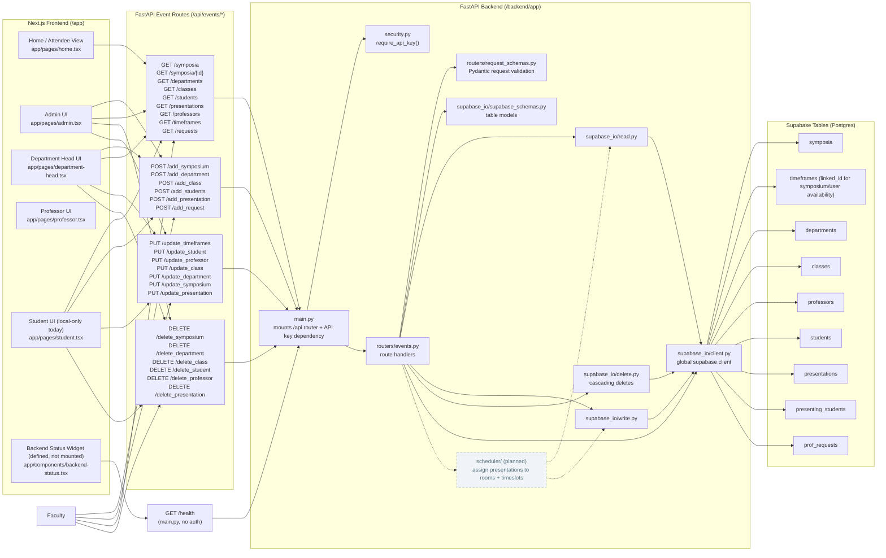

# Conference Scheduler Structural Documentation (Recommended Updates)

## Scheduling Algorithm (Planned)

The scheduling logic is not yet implemented — this is expected at the current stage. When built, it should live at `backend/app/scheduler/` and be invoked by `events.py` (likely via a new `POST /api/events/schedule` route triggered from the Admin UI).

**Inputs it will need:**
- All presentations for a symposium (duration in minutes, assigned class/department)
- Available timeframes per professor/presenter (from `timeframes` table via `linked_id`)
- Symposium timeframes (start/end windows, number of rooms available from `symposia.rooms_available`)

**Output:**
- Write `start_time` and `end_time` back to each `presentations` row (fields already exist in the schema but are currently `null`)

**Constraints to resolve:**
- No two presentations in the same room overlap
- A presenter is not double-booked across rooms
- Each presentation fits within a valid symposium timeframe window
- Presenter availability windows are respected

Dashed arrows in the diagram indicate the planned (unimplemented) call path.

---

## Route Drift You Should Decide How To Resolve

The frontend currently calls some REST-style routes that are not implemented in `backend/app/routers/events.py`:

- `PUT /api/events/symposia/{id}`
- `DELETE /api/events/symposia/{id}`
- `PUT /api/events/departments/{id}`
- `DELETE /api/events/departments/{id}`

Backend currently provides action-style equivalents:

- `PUT /api/events/update_symposium`
- `DELETE /api/events/delete_symposium`
- `DELETE /api/events/delete_department`

Note: `GET /api/events/symposia/{id}` is implemented — it was previously listed here in error.

## Data/Control Flow Notes

1. `main.py` applies `require_api_key()` to all `/api/events/*` routes.
2. `events.py` validates request models using `request_schemas.py`.
3. `events.py` uses `read.py`, `write.py`, and `delete.py`, and also performs direct `supabase.table(...)` calls for some operations.
4. `timeframes.linked_id` is reused for symposium windows and person/entity availability records, not only symposium records.

## Citations

Diagram conventions and project references are listed in [../CITATIONS.md](../CITATIONS.md).
