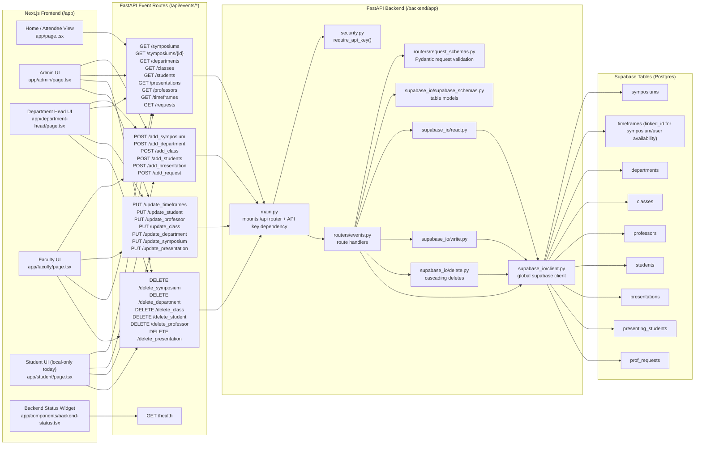

# Conference Scheduler Structural Documentation (Recommended Updates)

## Route Drift You Should Decide How To Resolve

The frontend currently calls some REST-style routes that are not implemented in `backend/app/routers/events.py`:

- `GET /api/events/symposiums/{id}`
- `PUT /api/events/symposiums/{id}`
- `DELETE /api/events/symposiums/{id}`
- `PUT /api/events/departments/{id}`
- `DELETE /api/events/departments/{id}`

Backend currently provides:

- `PUT /api/events/update_symposium`
- `DELETE /api/events/delete_symposium`
- `DELETE /api/events/delete_department`

No direct `GET /symposiums/{id}` or `PUT /departments/{id}` route exists right now.

## Data/Control Flow Notes

1. `main.py` applies `require_api_key()` to all `/api/events/*` routes.
2. `events.py` validates request models using `request_schemas.py`.
3. `events.py` uses `read.py`, `write.py`, and `delete.py`, and also performs direct `supabase.table(...)` calls for some operations.
4. `timeframes.linked_id` is reused for symposium windows and person/entity availability records, not only symposium records.
