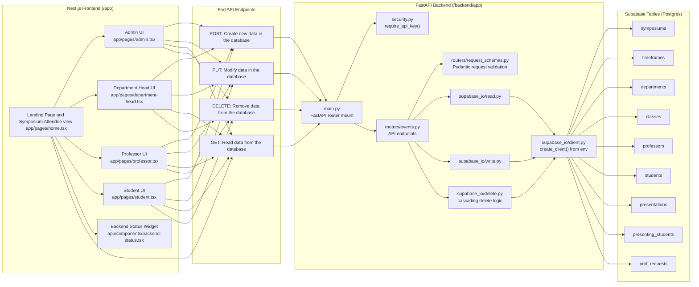

# Conference Scheduler Aspirational Structural Diagram

## Data and Control Flow

1. Frontend pages call backend endpoints using `NEXT_PUBLIC_BACKEND_URL`; protected API calls include `X-API-Key` from `NEXT_PUBLIC_BACKEND_API_KEY`.
2. `backend/app/main.py` mounts `/api/events/*` with a dependency on `require_api_key`, so all event routes are API-key protected.
3. `routers/events.py` validates request payloads via `request_schemas.py`, then performs table operations through:
   - `supabase_io/write.py` for inserts
   - `supabase_io/read.py` for queries
   - `supabase_io/delete.py` for recursive/cascading deletes
4. Data is persisted in Supabase tables, with `symposiums -> departments -> classes -> (professors, students, presentations)` and join-like helper tables (`presenting_students`, `prof_requests`).
 
## Citations

Diagram conventions and project references are listed in [../CITATIONS.md](../CITATIONS.md).
